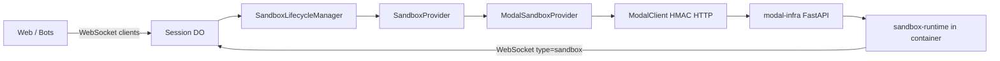

# Sandbox architecture (post-migration)

What survived the Modal-only migration and how Modal is wired today. This is the surface area a new
provider must integrate with.

## Data flow

- **Control plane** (Cloudflare Workers + Durable Objects): session state, lifecycle, WebSocket hub.
- **Data plane** (`packages/modal-infra`): Modal app with HTTP endpoints; creates/manages
  `modal.Sandbox` instances.
- **In-sandbox runtime** (`packages/sandbox-runtime`): provider-agnostic Python supervisor
  (OpenCode, bridge, git sync, hooks).

## Core abstraction: `SandboxProvider`

Defined in `packages/control-plane/src/sandbox/provider.ts`.

### Interface methods

| Method                        | Required | Purpose                             |
| ----------------------------- | -------- | ----------------------------------- |
| `createSandbox(config)`       | yes      | Fresh sandbox for a session         |
| `restoreFromSnapshot(config)` | optional | Boot from saved filesystem snapshot |
| `takeSnapshot(config)`        | optional | Persist sandbox state on inactivity |
| `resumeSandbox(config)`       | optional | Resume stopped sandbox in place     |
| `stopSandbox(config)`         | optional | Explicit stop via provider API      |

### Capability flags

`SandboxProviderCapabilities` drive lifecycle decisions in `lifecycle/decisions.ts` without
provider-specific branches in the orchestrator:

| Flag                       | Modal today | Effect                                                       |
| -------------------------- | ----------- | ------------------------------------------------------------ |
| `supportsSnapshots`        | `true`      | Inactivity alarm calls `takeSnapshot`                        |
| `supportsRestore`          | `true`      | Spawn decision can choose `restore` from `snapshot_image_id` |
| `supportsWarm`             | `true`      | Early `spawnSandbox` on typing (not Modal warm-pool API)     |
| `supportsPersistentResume` | `false`     | If `true`, spawn decision prefers `resume` over `restore`    |
| `supportsExplicitStop`     | `false`     | Provider-managed stop on inactivity vs snapshot-only         |

Modal provider capabilities are set in
`packages/control-plane/src/sandbox/providers/modal-provider.ts`.

## Key files

| File                                                             | Role                                                       |
| ---------------------------------------------------------------- | ---------------------------------------------------------- |
| `packages/control-plane/src/sandbox/provider.ts`                 | Interface, config/result types, `SandboxProviderError`     |
| `packages/control-plane/src/sandbox/providers/modal-provider.ts` | Reference `SandboxProvider` implementation                 |
| `packages/control-plane/src/sandbox/client.ts`                   | `ModalClient` — HMAC HTTP to `modal-infra` endpoints       |
| `packages/control-plane/src/sandbox/lifecycle/decisions.ts`      | Pure spawn/restore/resume/warm/circuit-breaker logic       |
| `packages/control-plane/src/sandbox/lifecycle/manager.ts`        | Orchestrator; injects `SandboxProvider`                    |
| `packages/control-plane/src/sandbox/sandbox-env.ts`              | `buildSessionConfig()` — shared env JSON for all providers |
| `packages/control-plane/src/sandbox/settings.ts`                 | Normalizes `SandboxSettings` (tunnels, CPU, memory)        |
| `packages/control-plane/src/session/durable-object.ts`           | Wires `createModalProvider()` into lifecycle manager       |
| `packages/control-plane/src/routes/repo-images.ts`               | Repo image build callbacks and triggers (Modal-only)       |
| `packages/control-plane/src/db/repo-images.ts`                   | D1 store; `RepoImageProvider = "modal"`                    |
| `packages/modal-infra/src/sandbox/manager.py`                    | Modal `Sandbox.create`, snapshots, tunnels                 |
| `packages/modal-infra/src/web_api.py`                            | HTTP endpoints consumed by `ModalClient`                   |
| `packages/modal-infra/src/scheduler/image_builder.py`            | Async repo image builds                                    |
| `packages/sandbox-runtime/src/sandbox_runtime/entrypoint.py`     | PID 1 supervisor inside sandbox                            |
| `packages/sandbox-runtime/src/sandbox_runtime/bridge.py`         | WebSocket bridge to control plane                          |

## Modal HTTP API (data plane contract)

`ModalClient` calls endpoints on
`https://<workspace>[-<suffix>]--open-inspect-<endpoint>.modal.run`:

| Client method         | Endpoint                    | Purpose                                                    |
| --------------------- | --------------------------- | ---------------------------------------------------------- |
| `createSandbox`       | `api-create-sandbox`        | New session sandbox                                        |
| `restoreSandbox`      | `api-restore-sandbox`       | Boot from snapshot image ID                                |
| `snapshotSandbox`     | `api-snapshot-sandbox`      | Filesystem snapshot                                        |
| `warmSandbox`         | `api-warm-sandbox`          | Pre-warm (implemented; lifecycle uses early spawn instead) |
| `buildRepoImage`      | `api-build-repo-image`      | Async repo image build                                     |
| `deleteProviderImage` | `api-delete-provider-image` | Best-effort cleanup                                        |
| `health`              | `api-health`                | Health check                                               |

Auth: `Authorization: Bearer <HMAC>` using shared `MODAL_API_SECRET`.

## Lifecycle spawn decision

`evaluateSpawnDecision()` in `lifecycle/decisions.ts` chooses among:

1. **`resume`** — if `supportsPersistentResume` and `providerObjectId` present (Daytona-style;
   unused by Modal)
2. **`restore`** — if `snapshot_image_id` and provider supports restore
3. **`spawn`** — fresh `createSandbox()` (optionally with `repoImageId`)

On inactivity timeout, Modal takes a filesystem snapshot; the image ID is stored as
`sandbox.snapshot_image_id` for the next restore.

## Repo images

Flow (Modal-only after migration):

1. Control plane registers build in D1 (`RepoImageStore.registerBuild`)
2. `ModalClient.buildRepoImage()` triggers `modal-infra` worker
3. Build sandbox runs with `IMAGE_BUILD_MODE=true`, clones repo, runs hooks
4. `snapshot_filesystem()` produces provider image ID
5. `sandbox-runtime` calls `/repo-images/build-complete` with `INTERNAL_CALLBACK_SECRET` HMAC
6. Session spawn passes `repoImageId` to skip clone/install on warm paths

See `docs/IMAGE_PREBUILD.md` for operator-facing documentation.

## Shared runtime contract

`buildSessionConfig()` in `sandbox-env.ts` serializes the same JSON env contract regardless of
provider. The in-sandbox entrypoint reads `SESSION_CONFIG` and does not import provider-specific
code.

`repo_image_callback.py` is auth-shape agnostic: expects `OI_REPO_IMAGE_BUILD_ID`, `CALLBACK_URL`,
and `CALLBACK_TOKEN` env vars injected by the data plane.

## Terraform (Modal always on)

| File                                                         | Role                                                      |
| ------------------------------------------------------------ | --------------------------------------------------------- |
| `terraform/environments/production/modal.tf`                 | Unconditional `module.modal_app` deploy                   |
| `terraform/modules/modal-app/`                               | `null_resource` + `modal deploy` on source hash change    |
| `terraform/environments/production/workers-control-plane.tf` | `MODAL_*` env bindings; `depends_on = [module.modal_app]` |

## Modal-specific naming (rename when adding provider #2)

These leak Modal into otherwise generic layers:

| Location                   | Name                              | Suggested generalization                   |
| -------------------------- | --------------------------------- | ------------------------------------------ |
| Session/sandbox DB columns | `modal_object_id`                 | `provider_object_id`                       |
| Repository adapter         | `updateSandboxModalObjectId()`    | `updateSandboxProviderObjectId()`          |
| Repo images type           | `RepoImageProvider = "modal"`     | Union type or string literal per provider  |
| Client helper              | `buildModalSandboxDashboardUrl()` | `buildSandboxDashboardUrl(provider, ...)`  |
| `sandbox/index.ts` export  | `createModalClient` only          | Generic client factory or provider package |

The `SandboxProvider` interface already uses generic names (`providerObjectId`, `provider_image_id`)
in several places — align DB and repository layers when introducing a second backend.

## What tests still cover multi-provider behavior

`packages/control-plane/src/sandbox/lifecycle/decisions.test.ts` includes Daytona-style resume
scenarios (`providerObjectId: "daytona-abc123"`) to validate capability-gated paths even though only
Modal is wired in production.
